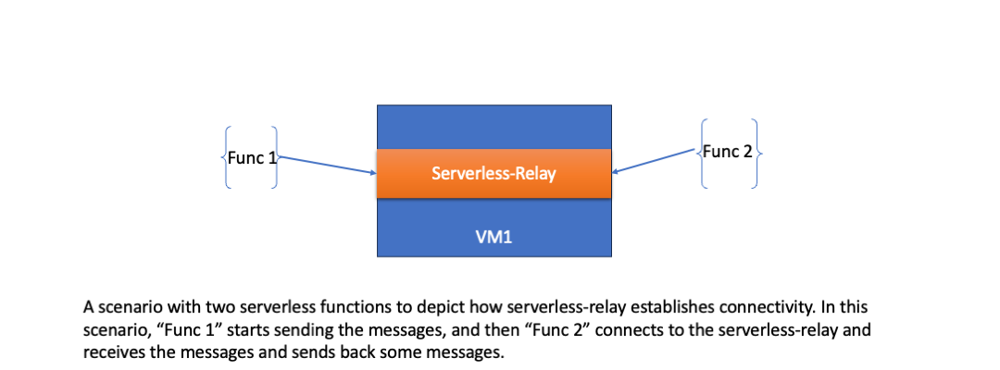

# Serverless-relay
A Relay maintaining persistent connection between serverless functions. 
A relay is needed when two clients want to send communicate between each other without having to host a server, and maintaining connections.
This is especially the case when we want one or more serverless functions/jobs to communicate with each other.

# Why is this needed?
A serverless job generally doesnt accept incoming connections. Hence, when two serverless jobs needs to communicate with each other, they would need to connect through a central relay/router.

In the context of Clusterlink, currently ClusterLink gateways expect reachability to the destination service which has to receive connections. An application if it wants to connect to a service, it will connect to the GWs and the GW in the destination cluster needs to make a tcp connection with the destination service.

However, when two transient jobs/functions running in serverless need to contact each other over a tcp connection, there is no generic way of doing this assuming the functions do not have/want to expose publicly reachable endpoints. This problem is currently not solved by Clusterlink, since it requires the GW to initiate a connection with one of the functions, which requires at least one of the functions to have a reachable endpoint accepting connections.

# How does serverless-relay solve this?

The serverless-relay runs as a separate process within a VM.

It does the following:
1) Binds and listen to a specific port, for the job/function to connect and send messages to the remote service. The remote service is already discovered by the gateway. 
2) The relay at one end accepts connection from a func1, and other end accepts connection from func2. Ideally it should validate the func1 & func2 using their certificates. 
3) When both funcs connect to the relay, an end-to-end connection is established, and funcs upgrade the connection to mTLS, and communicate with each other.

Details :
1) The relay starts a listener for each {func1, func2} pair communication.
2) It verifies the functions and manages routing between them.
   

# Steps to run serverless-relay

   make build

   ./bin/frelay start --port <portnum>

# Run a test client
   export MODE=flock_tls_server
   ./bin/client_function

# Run a test server
   export MODE=flock_tls_client
   ./bin/client_function

## Problem
Forwarding over the TCP socket of the tls connection fails.

## TODO
1) Move relay configuration to separate API, e.g. specify addRoute(func1, func2), and deleteRoute(func1,func2). 
