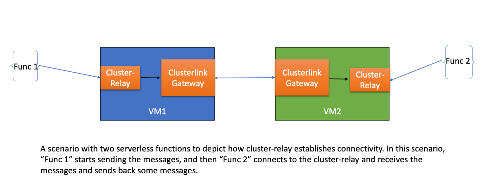

# cluster-relay
A Relay maintaining persistent connection between serverless functions and the clusterlink gateways. 
A relay is needed when two clients want to send communicate between each other without having to host a server, and maintaining connections.
This is especially the case when we want one or more serverless functions/jobs to communicate with each other.

# Why is this needed?
Currently ClusterLink gateways expect reachability to the destination service which has to receive connections. An application if it wants to connect to a service, it will connect to the GWs and the GW in the destination cluster needs to make a tcp connection with the destination service.

However, when two transient jobs/functions running in serverless need to contact each other over a tcp connection, there is no generic way of doing this assuming the functions do not have/want to expose publicly reachable endpoints. This problem is currently not solved by Clusterlink, since it requires the GW to initiate a connection with one of the functions, which requires at least one of the functions to have a reachable endpoint accepting connections.

# How does cluster-relay solve this?

The Cluster-relay runs as a separate process within the gateway VM for each function/job. Ideally, Clusterlink gateways should control the lifetime of the relay based on the management calls. 

It does the following:
1) Bind and listen to a specific port, for the job/function to connect and send messages to the remote service. The remote service is already discovered by the gateway. We assume the Clusterlink gateways provision a relay's ip:port and that is conveyed to the job/function through out-of-band mechanism. 
2) The relay at one end accepts connection from a client function (egress), and other end accepts/initiates connection to the gateway (ingress).
3) If a relay gets a connection from the gateway(ingress), it checks if there are no existing gateway connections, and then accepts it. It queues the messages in an ingress queue until client initiates a connection.
4) When the relay gets a connection from the client function (egress), it checks if there are no existing client connection, and then accepts it. It drains the ingress queue which contains the buffered messages, then dispatches messages from the gateway connection to the client.
5) In the previous step, if there is no existing gateway connection existing, it connects to the target remote service of the gateway, and dispatches the client messages to the gateway connection.
6) When a connection is tore-down from the client, it destroys the connections.

# Steps to run cluster-relay

   make build

   ./bin/cluster_relay start --port <portnum> --target <ip:port / Clusterlink service name>

   Refer to [tests/README.md](tests/README.md) for an end-to-end example
